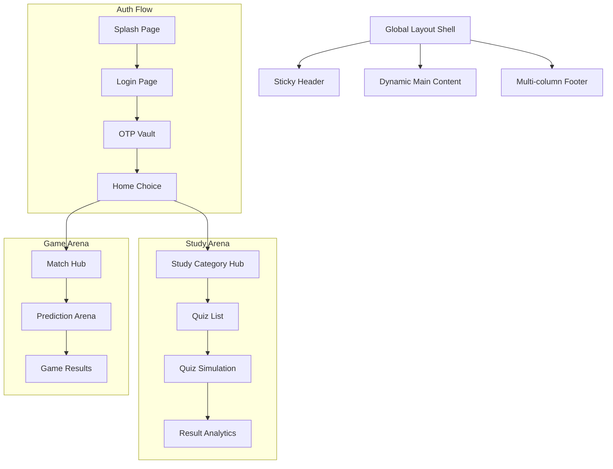

# Play11 Premium: Project Architecture & Working Flow

This document provides a comprehensive overview of the technical architecture, user journey, and module-specific workflows of the Play11 platform.

## 🚀 Tech Stack Overview
- **Frontend**: React (Vite)
- **Styling**: Vanilla CSS (Luxury Morphism Design System)
- **Icons**: Lucide React
- **Backend**: Node.js + Express
- **Database**: SQLite (better-sqlite3)
- **Auth**: JWT (JSON Web Tokens) with Mock SMS Gateway

---

## 🗺️ Application Architecture

---

## 🚦 Phase-wise Working Flow

### 1. Authentication Hub (The Gateway)
1. **Splash**: Initial branding entry point.
2. **Login**: Collects 10-digit mobile number. Split-screen bento feature display on desktop.
3. **OTP Vault**: High-security verification page. 
   - *Current Status*: Uses Mock OTP (`123456`) for development.
   - *Logic*: Validates against `otp_requests` table in SQLite.
4. **Session**: Upon verification, a JWT token is stored in `localStorage` alongside the user's mobile number.

### 2. Home Choice (The Hub)
- A high-fidelity "Zenith" page where users choose their path.
- **Desktop**: Side-by-side 50/50 cards with 3D-hover effects.
- **Mobile**: Vertical stack.
- **Persistent Layout**: Integrates the global website Header and Footer.

### 3. Study Arena (Academic Mastery)
1. **Category Discovery**: Users browse through 10+ exam categories (SSC, BPSC, UPSC, etc.).
2. **Quiz Selection**: Each category lists available mocks with time and question counts.
3. **Play Zone**: Interactive quiz interface with auto-save and timer logic.
4. **Results**: Detailed summary of correct/incorrect answers with performance analytics.

### 4. Game Arena (Sports Prediction)
1. **Match List**: A real-time schedule of upcoming matches (IPL focus).
2. **Prediction Arena**: Users predict outcome-based questions (Toss, Winner, Top Scorer).
3. **Leaderboard**: Final match results determine rankings.

### 5. Profile & History
- **History Page**: A centralized archive where users can filter their past performance across both Study and Game zones.
- **Profile**: Displays personal stats and account-level information.

---

## 📂 Backend Logic (Business Layer)

- **Controllers**:
  - `auth.controller.js`: Handles session, mock OTP generation, and JWT signing.
  - `quiz.controller.js`: Manages category retrieval and quiz metadata.
- **Database Schema**:
  - `users`: Core profile data.
  - `categories` & `quizzes`: Content management.
  - `questions`: Question pool for all zones.
  - `submissions`: Records of user performance and history.
  - `matches`: Real-time schedule for the Game Arena.

---

## 💎 Design Language: Luxury Morphism
The project adheres to a custom-designed aesthetic:
- **Glassmorphism**: 24px blur, low-opacity white backgrounds, and multi-layered shadows.
- **Bento Grids**: 12-column foundation for desktop, automatically collapsing to single columns for mobile.
- **Interactive States**: Pulse dots for system status, glowing button rays, and bento-tile lifts.

---

## 🛠️ How to Maintain
1. **Data Seeding**: Run `node backend/seed.js` to refresh the platform with new content.
2. **Dev Server**: Use `npm run dev:all` to start both frontend and backend concurrently.
